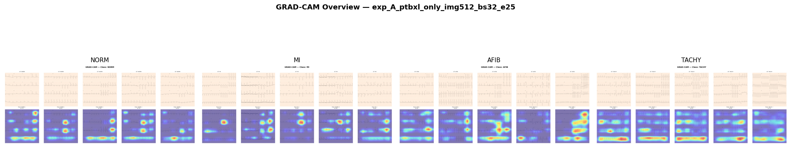

# ECG Synthetic Augmentation Research

> **Can AI-generated ECG images improve cardiac arrhythmia classification?**
> A comparative study of EfficientNet-B0 trained on real clinical ECGs
> augmented with Imagen-generated and NeuroKit2-simulated images.

---

## Project Overview

This project extends the **Nano Banana pneumonia synthetic imaging paper**
to the ECG domain. We investigate whether synthetic ECG augmentation —
using Google's Imagen 3 (Nano Banana Pro) generative model and
NeuroKit2 physiological simulation — improves CNN classification
performance on real clinical ECG data from the PTB-XL dataset.

**Research Question:**
> Does Imagen-generated synthetic ECG augmentation improve CNN
> classification performance on real PTB-XL ECG data, compared to
> a real-data-only baseline and a combined augmentation baseline?

---

## Three Experiments

| Experiment | Training Data | Purpose |
|---|---|---|
| **A** | PTB-XL real (4,456 images) | Baseline |
| **B** | PTB-XL + Imagen (5,096 images) | LLM augmentation effect |
| **C** | PTB-XL + Imagen + NeuroKit2 (11,096 images) | Combined augmentation |

Same architecture, same hyperparameters across all three.
Only training data changes.

---

## Dataset

### PTB-XL (Real Clinical Data)
- Source: PhysioNet PTB-XL v1.0.3
- 4 classes selected: **NORM, MI, AFIB, TACHY**
- Rendered as 12-lead ECG paper images (no text labels)
- Balanced: NORM/MI capped at 1500, AFIB ~1030, TACHY ~426

### Imagen Generated
- Model: Gemini 3 Pro Image (Nano Banana Pro) via Google Vertex AI
- 160 images per class (640 total)
- Automated generation with seed logging for reproducibility
- OCR-cleaned with EasyOCR + inpainting to remove text artifacts

### NeuroKit2 Synthetic
- Physiologically simulated signals per condition
- Rendered with identical pipeline to PTB-XL (no text labels)
- Capped at 1500 per class for balanced augmentation

### Class Distribution (Final)

| Class | PTB-XL | Imagen | NeuroKit2 | Total (Exp C) |
|---|---|---|---|---|
| NORM | 1500 | 160 | 1500 | 3160 |
| MI | 1500 | 160 | 1500 | 3160 |
| AFIB | 1030 | 160 | 1500 | 2690 |
| TACHY | 426 | 160 | 1500 | 2086 |

---

## Model Architecture

- **EfficientNet-B0** pretrained on ImageNet, fine-tuned
- Input: 512×512 RGB ECG images
- Loss: Focal Loss (γ=2) with class weights
- Optimizer: AdamW (lr=1e-4, weight_decay=1e-4)
- Scheduler: CosineAnnealingLR
- Mixed precision training (FP16)
- 25 epochs, batch size 32

---

## Results

### Key Metrics Comparison

| Metric | Exp A (Baseline) | Exp B (+Imagen) | Exp C (+Imagen+NK2) |
|---|---|---|---|
| **Test Accuracy** | 0.8991 | 0.9118 | — |
| **Macro F1** | 0.8843 | 0.9083 | — |
| **Macro ROC-AUC** | 0.9802 | 0.9806 | — |
| **Macro PR-AUC** | 0.9307 | 0.9637 | — |
| **Cohen Kappa** | 0.8587 | 0.8784 | — |
| **MCC** | 0.8605 | 0.8805 | — |

### Per-Class F1

| Class | Exp A | Exp B | Exp C | Δ (A→B) |
|---|---|---|---|---|
| NORM | 0.9045 | 0.9326 | — | +0.028 |
| MI | 0.8905 | 0.8758 | — | −0.015 |
| AFIB | 0.9552 | 0.9431 | — | −0.012 |
| **TACHY** | **0.7872** | **0.8819** | — | **+0.095** |

> TACHY improvement of +9.5% is the headline finding.
> This is the most data-scarce class (426 real records).
> Imagen augmentation directly addresses the imbalance.

---

## Visualizations

### Training Curves

| Experiment A | Experiment B |
|---|---|
|  |  |

### Confusion Matrices

| Experiment A | Experiment B |
|---|---|
|  |  |

### ROC Curves

| Experiment A | Experiment B |
|---|---|
|  |  |

### GRAD-CAM Explainability

| Experiment A | Experiment B |
|---|---|
|  |  |

> GRAD-CAM confirms the model attends to ECG waveform morphology,
> not background artifacts or rendering style.

---

## Project Structure
ecg-synthetic-research/
├── data/
│   ├── rendered/
│   │   ├── ptbxl/          # Real PTB-XL ECG renders
│   │   ├── imagen_clean/   # Imagen generated + OCR cleaned
│   │   └── neurokit2/      # NeuroKit2 simulated renders
│   └── splits/             # Train/val/test CSVs per experiment
├── src/
│   ├── rendering/
│   │   ├── render_ptbxl.py
│   │   ├── fix_neurokit2.py
│   │   └── sanitize_imagen.py
│   ├── generation/
│   │   ├── imagen_generate.py
│   │   └── prompts/prompts.csv
│   ├── training/
│   │   └── train.py
│   ├── explainability/
│   │   └── gradcam.py
│   └── viz/
│       └── dashboard.py
├── outputs/
│   ├── models/             # Saved .pth checkpoints
│   └── results/            # Per-experiment metrics + plots
├── metadata/               # Dataset manifest CSVs
├── requirements.txt
└── README.md
---

## Setup

```bash
# Clone
git clone https://github.com/YOURUSERNAME/ecg-synthetic-research.git
cd ecg-synthetic-research

# Environment
python -m venv venv
.\venv\Scripts\activate

# Dependencies
pip install -r requirements.txt

# CUDA PyTorch (RTX 4050)
pip install torch torchvision torchaudio --index-url https://download.pytorch.org/whl/cu124
```

---

## Running Experiments

```bash
# Render PTB-XL dataset
python src/rendering/render_ptbxl.py

# Generate Imagen images (requires Google Cloud credentials)
python src/generation/imagen_generate.py

# Clean Imagen images
python src/rendering/sanitize_imagen.py

# Train all experiments (GRAD-CAM runs automatically)
python src/training/train.py --experiment A
python src/training/train.py --experiment B
python src/training/train.py --experiment C

# Launch dashboard
streamlit run src/viz/dashboard.py
```

---

## Limitations

- Synthetic ECGs not validated by cardiologists
- TACHY class: 426 real records — statistically thin baseline
- Imagen generates visually plausible but potentially
  physiologically inaccurate waveforms
- NeuroKit2 TACHY simulates sinus tachycardia only;
  PTB-XL TACHY includes SVT and ectopic rhythms
- No patient-level train/test split enforced
- Results not for clinical deployment

---

## Tech Stack

| Component | Library |
|---|---|
| Signal processing | wfdb, neurokit2 |
| Image generation | google-genai, vertexai |
| OCR cleanup | easyocr, opencv |
| Deep learning | PyTorch, torchvision |
| Explainability | pytorch-grad-cam |
| Dashboard | Streamlit |
| Data | pandas, numpy, scikit-learn |

---

## Authors

**TKR** — BS Data Science, UMT Lahore, Pakistan
**Hamza Chaudhry** — BS Data Science, UMT Lahore, Pakistan
**Waleed Nadeem** — BS Data Science, UMT Lahore, Pakistan
**Hashaam Ijaz** — BS Data Science, UMT Lahore, Pakistan