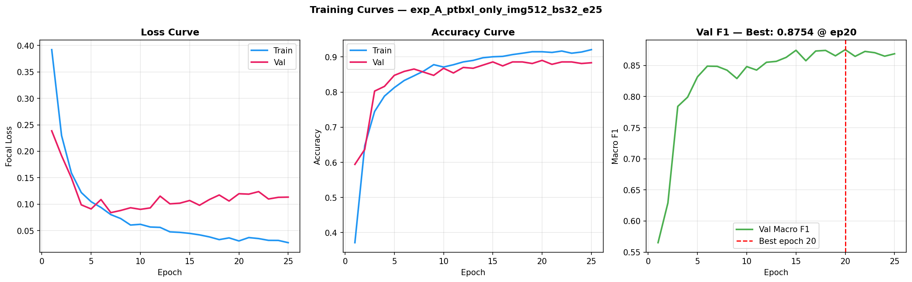
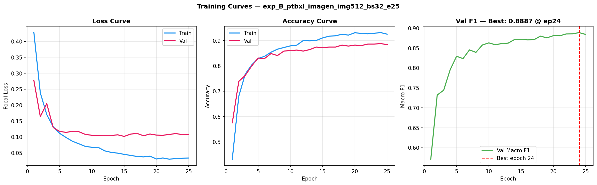
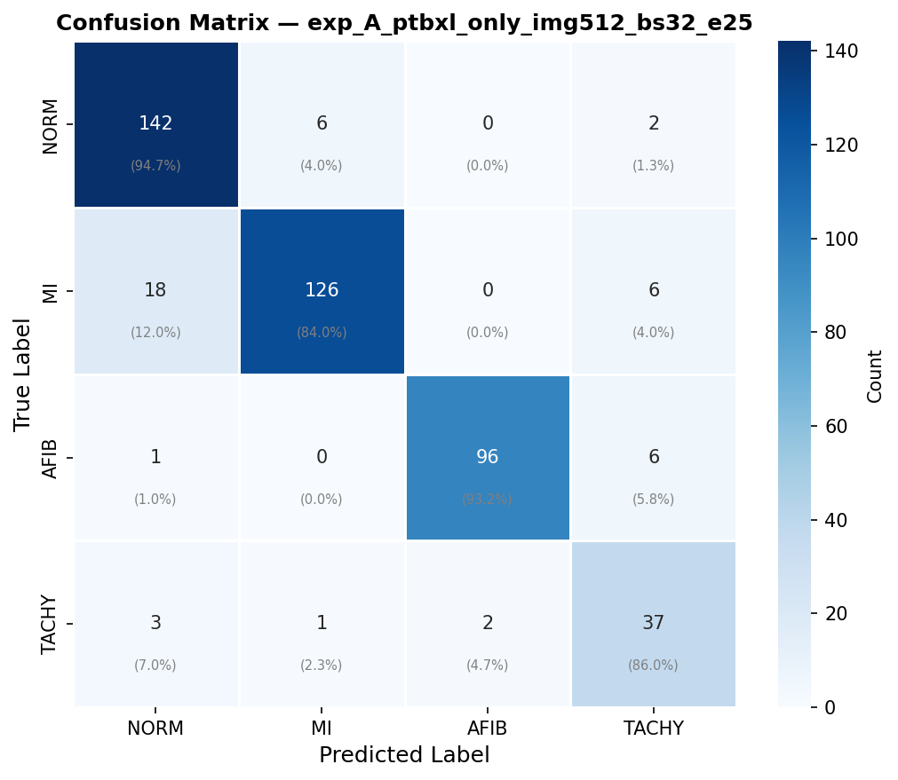
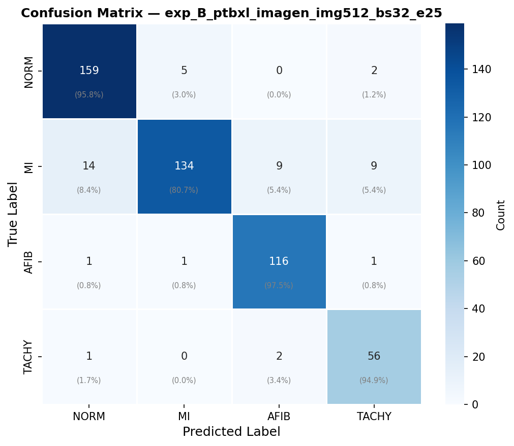
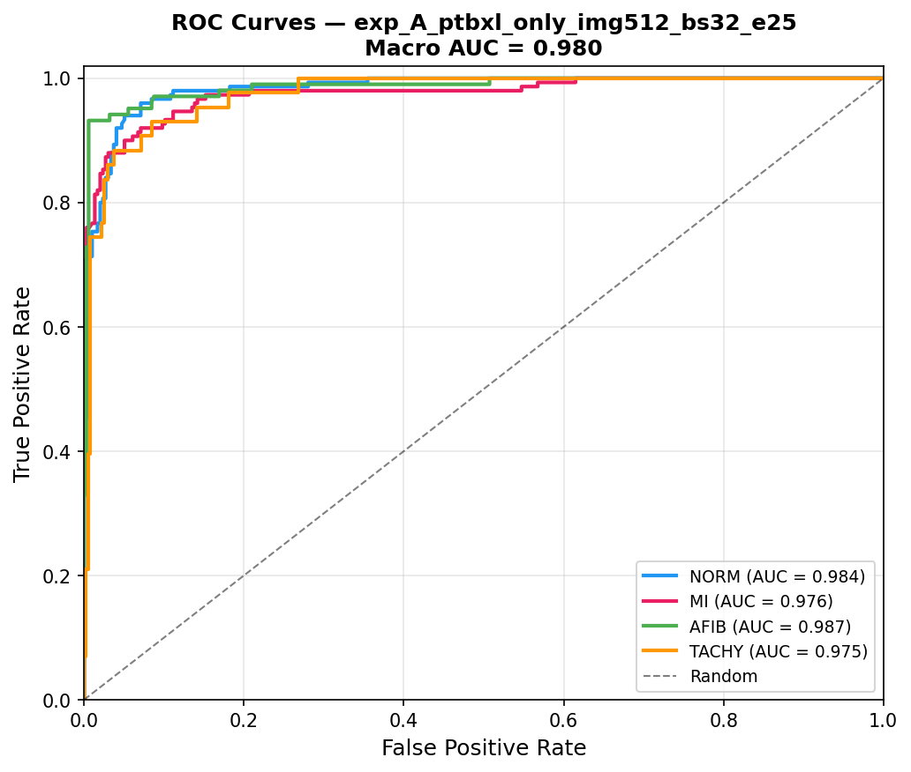
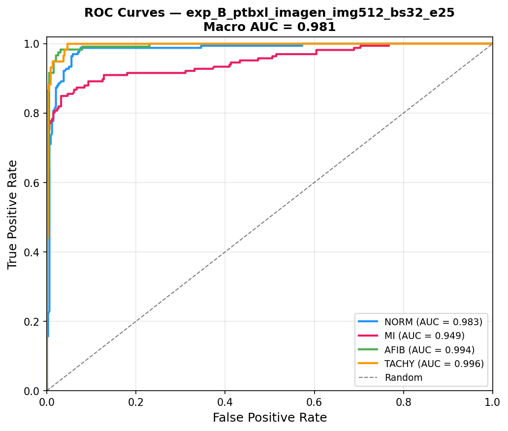
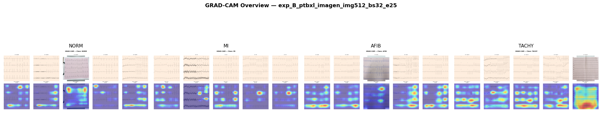

# 🫀 ECG Synthetic Augmentation Research

> **Can AI-generated ECG images improve cardiac arrhythmia classification?**
> A comparative study of EfficientNet-B0 trained on real clinical ECGs,
> augmented with Imagen-generated and NeuroKit2-simulated images.

---

## Overview

This project extends the **Nano Banana pneumonia synthetic imaging paper**
to the ECG domain. We investigate whether synthetic ECG augmentation —
using Google Imagen 3 (Nano Banana Pro) and NeuroKit2 physiological
simulation — improves CNN classification on real PTB-XL clinical data.

**Research Question:**
> Does Imagen-generated synthetic ECG augmentation improve CNN
> classification performance on real PTB-XL ECG data, compared to
> a real-data-only baseline and a combined augmentation baseline?

---

## Three Experiments

| Experiment | Training Data | Images | Purpose |
|:---:|---|:---:|---|
| **A** | PTB-XL real only | 4,456 | Baseline — no augmentation |
| **B** | PTB-XL + Imagen | 5,096 | LLM augmentation effect |
| **C** | PTB-XL + Imagen + NeuroKit2 | 11,096 | Combined augmentation |

> Same architecture · Same hyperparameters · Only training data changes.

---

## Dataset

### Sources

**PTB-XL** — Real clinical 12-lead ECGs from PhysioNet (v1.0.3).
Rendered as clean ECG paper images with no text labels to prevent
data leakage. GRAD-CAM confirmed label-free rendering.

**Imagen** — Generated via Google Gemini 3 Pro Image (Nano Banana Pro)
on Vertex AI. 160 images per class. Seed-logged for reproducibility.
OCR-cleaned with EasyOCR + inpainting to remove any text artifacts.

**NeuroKit2** — Physiologically simulated signals rendered with
identical pipeline to PTB-XL. Capped at 1500 per class.

### Class Distribution

| Class | PTB-XL | Imagen | NeuroKit2 | Exp C Total |
|---|:---:|:---:|:---:|:---:|
| NORM — Normal ECG | 1500 | 160 | 1500 | 3160 |
| MI — Myocardial Infarction | 1500 | 160 | 1500 | 3160 |
| AFIB — Atrial Fibrillation | 1030 | 160 | 1500 | 2690 |
| TACHY — Tachycardia | 426 | 160 | 1500 | 2086 |

> TACHY has the fewest real records (426) — augmentation effect
> is most pronounced here.

---

## Model

| Component | Choice |
|---|---|
| Architecture | EfficientNet-B0 (ImageNet pretrained) |
| Input | 512 × 512 RGB ECG images |
| Loss | Focal Loss γ=2 + class weights |
| Optimizer | AdamW lr=1e-4 wd=1e-4 |
| Scheduler | CosineAnnealingLR |
| Precision | FP16 mixed precision |
| Epochs | 25 · Batch 32 |
| GPU | NVIDIA RTX 4050 6GB |

---

## Results

### Scalar Metrics

| Metric | Exp A | Exp B | Exp C |
|---|:---:|:---:|:---:|
| Test Accuracy | 0.8991 | 0.9118 | — |
| **Macro F1** | **0.8843** | **0.9083** | — |
| Macro ROC-AUC | 0.9802 | 0.9806 | — |
| Macro PR-AUC | 0.9307 | 0.9637 | — |
| Cohen Kappa | 0.8587 | 0.8784 | — |
| MCC | 0.8605 | 0.8805 | — |

### Per-Class F1

| Class | Exp A | Exp B | Exp C | Δ A→B |
|---|:---:|:---:|:---:|:---:|
| NORM | 0.9045 | 0.9326 | — | +0.028 |
| MI | 0.8905 | 0.8758 | — | −0.015 |
| AFIB | 0.9552 | 0.9431 | — | −0.012 |
| **TACHY** | **0.7872** | **0.8819** | — | **+0.095** ⬆ |

> **+9.5% TACHY F1 improvement** from adding 160 Imagen images.
> This directly validates the augmentation hypothesis on the
> most data-scarce class.

---

## Training Curves

| Experiment A | Experiment B |
|:---:|:---:|
|  |  |

---

## Confusion Matrices

| Experiment A | Experiment B |
|:---:|:---:|
|  |  |

---

## ROC Curves

| Experiment A | Experiment B |
|:---:|:---:|
|  |  |

---

## GRAD-CAM Explainability

GRAD-CAM confirms the model attends to ECG waveform morphology —
not background, grid artifacts, or rendering style.

| Experiment A | Experiment B |
|:---:|:---:|
|  |  |

---

## Project Structure
````
ecg-synthetic-research/
│
├── data/
│   ├── rendered/
│   │   ├── ptbxl/              Real PTB-XL ECG renders
│   │   ├── imagen_clean/       Imagen generated + OCR cleaned
│   │   └── neurokit2/          NeuroKit2 simulated renders
│   └── splits/                 Train / val / test CSVs per experiment
│
├── src/
│   ├── rendering/
│   │   ├── render_ptbxl.py     PTB-XL signal → ECG image
│   │   ├── render_neurokit2.py NeuroKit2 signal → ECG image
│   │   ├── fix_neurokit2.py    Strip text header from NK2 images
│   │   └── sanitize_imagen.py  OCR + inpaint Imagen text artifacts
│   ├── generation/
│   │   ├── imagen_generate.py  Vertex AI Imagen batch generation
│   │   └── prompts/
│   │       └── prompts.csv     8-10 prompt templates per class
│   ├── training/
│   │   └── train.py            EfficientNet-B0 training pipeline
│   ├── explainability/
│   │   └── gradcam.py          GRAD-CAM visualization
│   └── viz/
│       └── dashboard.py        Streamlit comparison dashboard
│
├── outputs/
│   ├── models/                 Saved .pth checkpoints
│   ├── results/                Per-experiment metrics + plots
│   └── gradcam/                GRAD-CAM visualizations
│
├── metadata/                   Dataset manifest CSVs
├── requirements.txt
└── README.md
````
---

## Setup

```bash
git clone https://github.com/YOURUSERNAME/ecg-synthetic-research.git
cd ecg-synthetic-research

python -m venv venv
.\venv\Scripts\activate
pip install -r requirements.txt

# CUDA PyTorch — RTX 4050
pip install torch torchvision torchaudio \
    --index-url https://download.pytorch.org/whl/cu124
```

---

## Reproducing Results

```bash
# 1. Render PTB-XL dataset
python src/rendering/render_ptbxl.py

# 2. Simulate NeuroKit2 dataset
python src/rendering/render_neurokit2.py

# 3. Generate Imagen images (requires Google Cloud credentials)
python src/generation/imagen_generate.py

# 4. Clean Imagen text artifacts
python src/rendering/sanitize_imagen.py

# 5. Train all experiments
python src/training/train.py --experiment A
python src/training/train.py --experiment B
python src/training/train.py --experiment C

# 6. Launch dashboard
streamlit run src/viz/dashboard.py
```

---

## Limitations

- Synthetic ECGs not validated by cardiologists
- TACHY: 426 real records — thin statistical base
- Imagen may produce visually plausible but physiologically
  inaccurate waveforms
- NeuroKit2 TACHY = sinus tachycardia only; PTB-XL TACHY
  includes SVT and ectopic rhythms
- No patient-level train/test split enforced
- Not intended for clinical deployment

---

## Tech Stack

`PyTorch` · `EfficientNet-B0` · `Vertex AI Imagen 3` · `NeuroKit2`
`PTB-XL` · `EasyOCR` · `GRAD-CAM` · `Streamlit` · `scikit-learn`

---

## Authors

<table>
  <tr>
    <td align="center">
      <b>TKR</b><br>
      BS Data Science<br>
      UMT Lahore
    </td>
    <td align="center">
      <b>Hamza Chaudhry</b><br>
      BS Data Science<br>
      UMT Lahore
    </td>
    <td align="center">
      <b>Waleed Nadeem</b><br>
      BS Data Science<br>
      UMT Lahore
    </td>
    <td align="center">
      <b>Hashaam Ijaz</b><br>
      BS Data Science<br>
      UMT Lahore
    </td>
  </tr>
</table>

> *Target venue: International Medical AI Conference, Dubai.*

---

## License

This project is for academic research purposes only.
PTB-XL data is subject to the
[PhysioNet Credentialed Health Data License](https://physionet.org/content/ptb-xl/view-license/1.0.3/).