<div align="center">

# ECG Synthetic Augmentation Research

**Can AI-generated ECG images improve cardiac arrhythmia classification on real clinical data?**

A controlled, single-variable study of **EfficientNet** trained on real PTB-XL ECGs and progressively
augmented with **Gemini 3 Pro Image** (generative) and **NeuroKit2** (physiologically simulated) images —
under strict **patient-grouped cross-validation** with a **real-only held-out test**.


</div>

---

## TL;DR

> Adding synthetic images to a real-ECG training set produces a **modest but statistically
> significant** improvement — *not* a dramatic one. Under repeated-seed, patient-grouped
> cross-validation (**n = 9** estimates), generative augmentation lifts **macro-F1 by ~1.7 points**
> and the scarce **TACHY class by ~3 points** over a real-only baseline (paired *p* < 0.01, 9/9
> folds positive). The effect **replicates on a second backbone (EfficientNet-B1)**. The
> **amount** of simulation matters more than adding it at all — a *capped* dose beats an
> uncapped one. Grad-CAM confirms the network attends to **waveform morphology**, not chart
> artifacts.

---

## The Pipeline

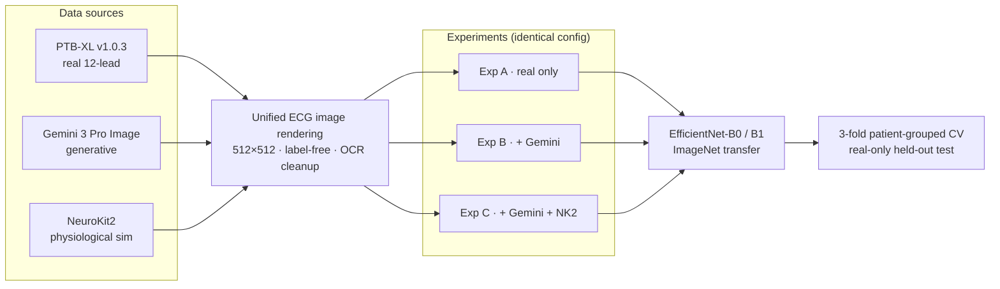

### The one methodological rule that makes this honest

Synthetic images live **only in the training split**. Validation and test are **real PTB-XL only**,
and patients are grouped so **no patient appears in more than one fold** — eliminating
patient-identity leakage.

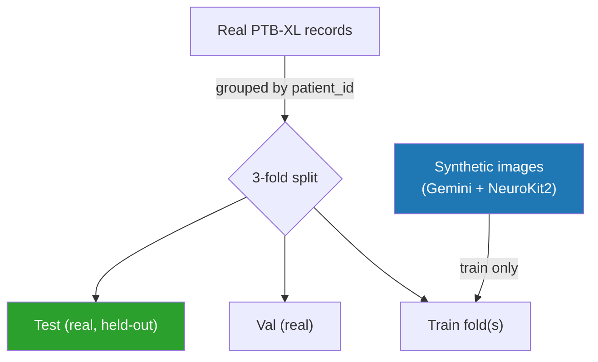

---

## Experiments

| ID | Training Data | Test Data | Purpose |
|:---:|---|---|---|
| **A** | PTB-XL real (4,456) | PTB-XL real, patient-split | Baseline |
| **B** | PTB-XL + Gemini (5,096) | PTB-XL real, patient-split | Generative augmentation |
| **C** | PTB-XL + Gemini + NeuroKit2 capped (7,096) | PTB-XL real, patient-split | Combined augmentation |
| **D**\* | NeuroKit2 only | Full PTB-XL real | Domain-transfer ablation |
| **E**\* | Gemini only | Full PTB-XL real | Domain-transfer ablation |

> \*D and E are **ablations** confirming that synthetic-only training cannot replace real data
> (D macro-F1 = 0.328, E = 0.397). This validates that the A→B→C gains come from *augmenting*
> real data, not from synthetic images being trivially separable or leaking test information.

**Validation:** 3-fold patient-grouped cross-validation, with **repeated-seed** CV (n = 9 estimates)
for significance testing. Leakage verification in `outputs/leakage_reports/`.

---

## Primary Results — real held-out test (3-fold mean)

| Experiment | Accuracy | Macro-F1 | ROC-AUC | PR-AUC | Cohen's κ | MCC | ECE ↓ |
|---|:---:|:---:|:---:|:---:|:---:|:---:|:---:|
| **A** — real only | 0.8813 | 0.8693 | 0.9753 | 0.9344 | 0.8344 | 0.8375 | 0.105 |
| **B** — + Gemini | 0.8936 | 0.8865 | 0.9791 | 0.9413 | 0.8508 | 0.8528 | 0.098 |
| **C** — + Gemini + NK2 | **0.9015** | **0.8921** | **0.9813** | **0.9433** | **0.8617** | **0.8624** | **0.088** |

### Is the improvement real? (repeated-seed paired test, n = 9)

| Comparison | Δ Macro-F1 | Δ TACHY-F1 | Consistency | *p* (macro / TACHY) |
|---|:---:|:---:|:---:|:---:|
| **B − A** | +1.65% | +3.05% | 9/9 positive | 0.005 / 0.002 |
| **C − A** (capped sim) | +1.89% | +2.32% | 9/9 positive | <0.001 / 0.005 |
| C(full) − B | ≈ 0 | ≈ 0 | inconsistent | n.s. |

<div align="center">
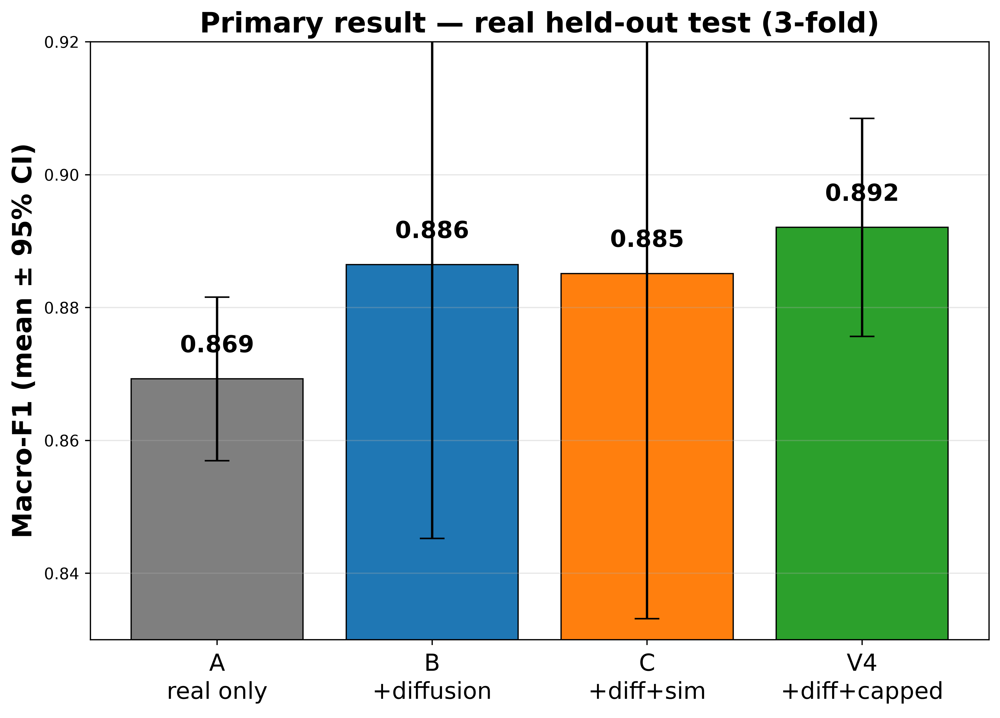
<br/><em>Left: absolute macro-F1 (dots = folds). Right: paired improvement over the real-only baseline
— every effect's 95% CI sits above zero.</em>
</div>

### Per-class F1 (3-fold mean)

| Experiment | NORM | MI | AFIB | TACHY |
|---|:---:|:---:|:---:|:---:|
| **A** — real only | 0.9095 | 0.8493 | 0.9182 | 0.8001 |
| **B** — + Gemini | 0.9091 | 0.8639 | 0.9316 | **0.8411** |
| **C** — + Gemini + NK2 | **0.9171** | **0.8801** | **0.9345** | 0.8365 |

> The largest single-class F1 gain is on **MI** (+3.1) and **TACHY** (+4.1 at B). Augmentation
> **redistributes** performance toward the harder, scarcer classes rather than lifting every
> class uniformly.

---

## Confusion Matrices (row-normalized recall, %)

<div align="center">
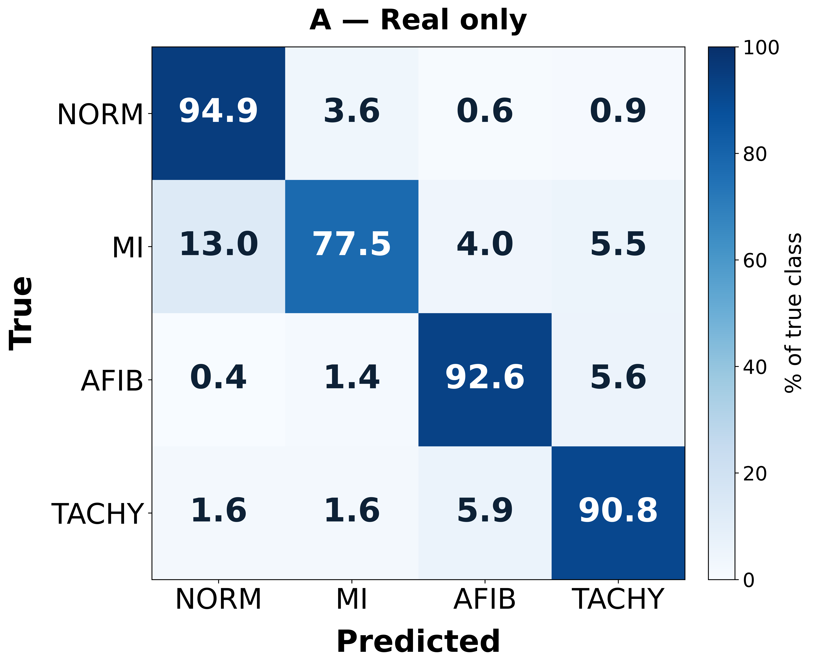
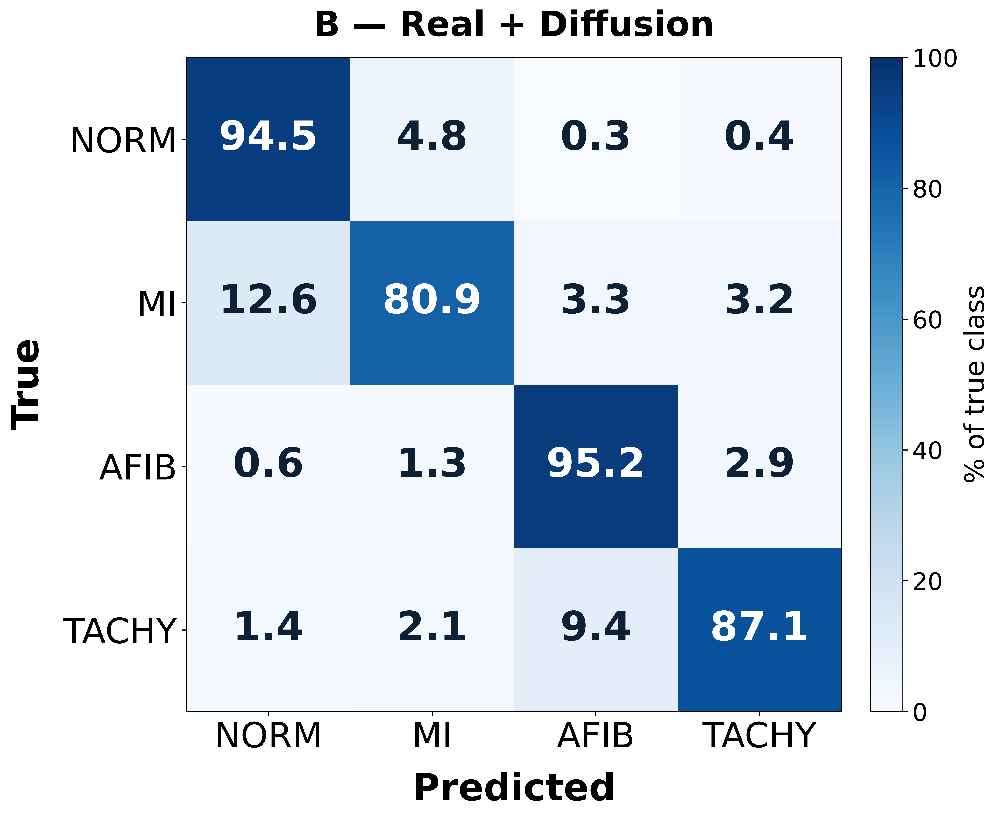
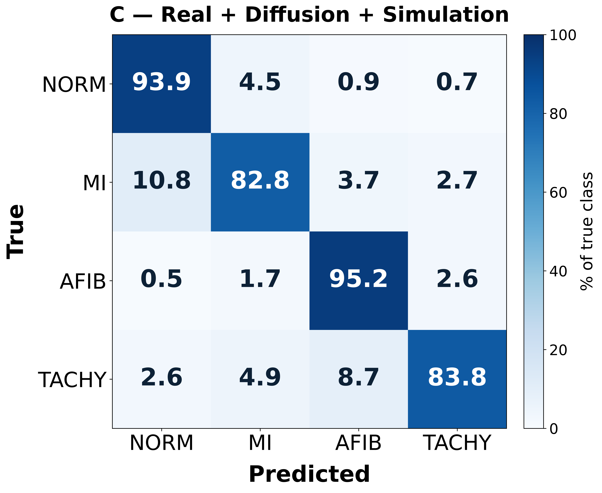
<br/><em>A (real only) · B (+ Gemini) · C (+ Gemini + NeuroKit2). MI and AFIB recall rise; the
TACHY F1 gain comes from improved <strong>precision</strong> (fewer false positives), not recall.</em>
</div>

---

## Secondary Evaluation — robustness across test domains

Beyond the primary real-only test, each model is also evaluated on a **held-out synthetic** set
(NeuroKit2 traces never seen in training) and a **balanced 50:50 combined** set.

| Model | Real | Synthetic (held-out) | Combined (50:50) |
|---|:---:|:---:|:---:|
| **A** — real only | 0.869 | 0.441 | 0.679 |
| **B** — + Gemini | 0.887 | 0.557 | 0.747 |
| **C** — + Gemini + capped NK2 | 0.892 | **0.997** | **0.945** |

<div align="center">
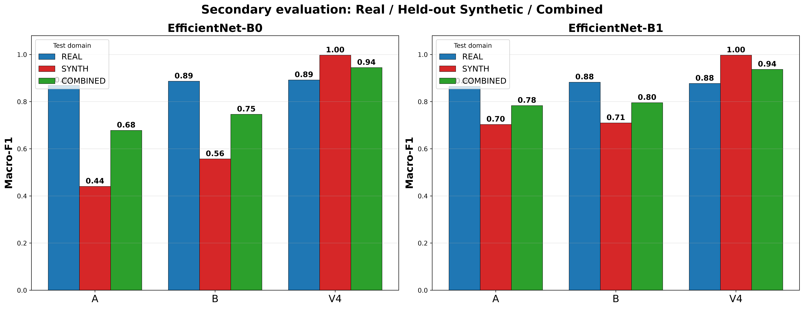
</div>

> The **combined** column is a *robustness* result, **not** real-world clinical performance — a model
> that has seen NeuroKit2 during training naturally classifies held-out NeuroKit2 well. The point
> is that adding simulation does not *harm* real-domain accuracy while broadening the domain the
> model handles.

---

## Architecture Generalization — EfficientNet-B1

The augmentation effect is **not an artifact of one backbone**. Repeating A/B/C on EfficientNet-B1:

| EfficientNet-B1 (3-fold mean) | Macro-F1 | TACHY-F1 |
|---|:---:|:---:|
| **A** — real only | 0.865 | 0.803 |
| **B** — + Gemini | 0.883 | 0.832 |
| **C** — + Gemini + capped NK2 | 0.877 | 0.818 |

> The generative gain replicates: **B − A = +1.8 macro-F1, 3/3 folds, *p* = 0.024.**

---

## Domain-Transfer Ablation (train on synthetic, test on real)

| Experiment | Accuracy | Macro-F1 | ROC-AUC | Interpretation |
|---|:---:|:---:|:---:|---|
| **D** — NK2 → PTB-XL | 0.350 | 0.328 | 0.637 | Large sim-to-real gap |
| **E** — Gemini → PTB-XL | 0.442 | 0.397 | 0.721 | Gemini transfers closer to real than NK2 |

Both transfer poorly on their own — exactly the reassuring result. It confirms the value of
synthetic data is as an **augmentation of** real data, not a replacement for it.

---

## Grad-CAM — what the network looks at

> Attention concentrates on **waveform morphology** (QRS complexes, rhythm spacing) rather than
> chart borders or grid artifacts. Each column: input render → class-discriminative heatmap →
> zoomed crop of the peak-activation region. Only correctly classified, high-confidence samples shown.

<div align="center">

| NORM | MI | AFIB | TACHY |
|:---:|:---:|:---:|:---:|
| 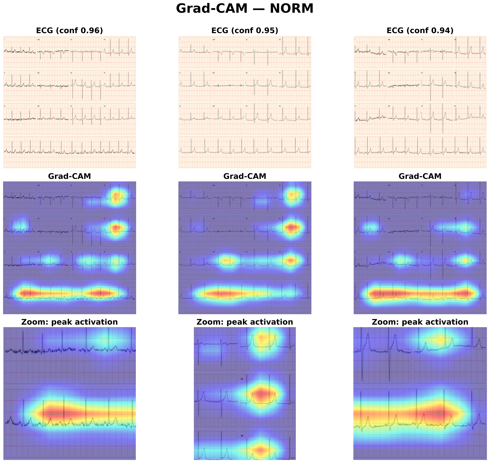 | 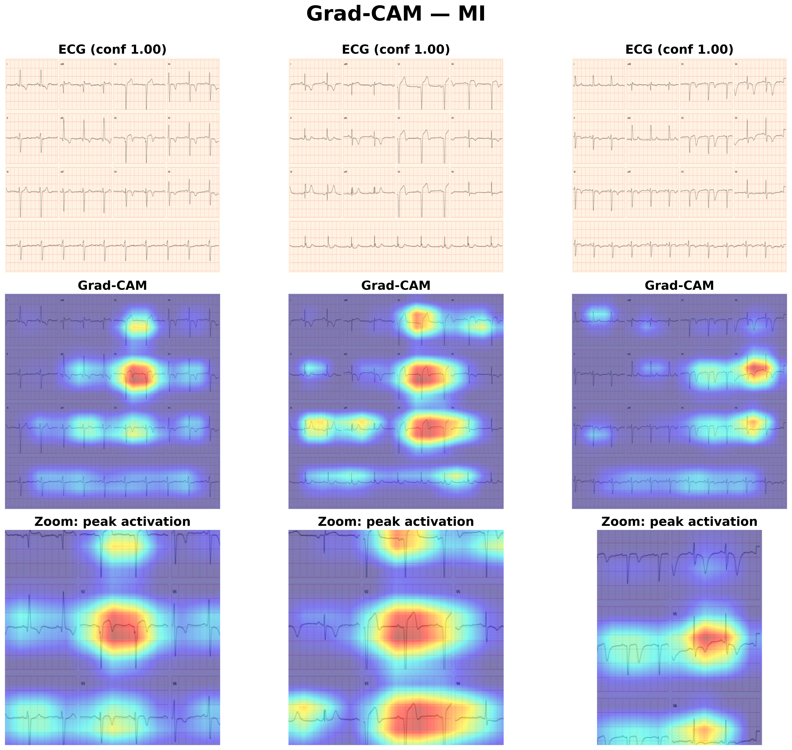 | 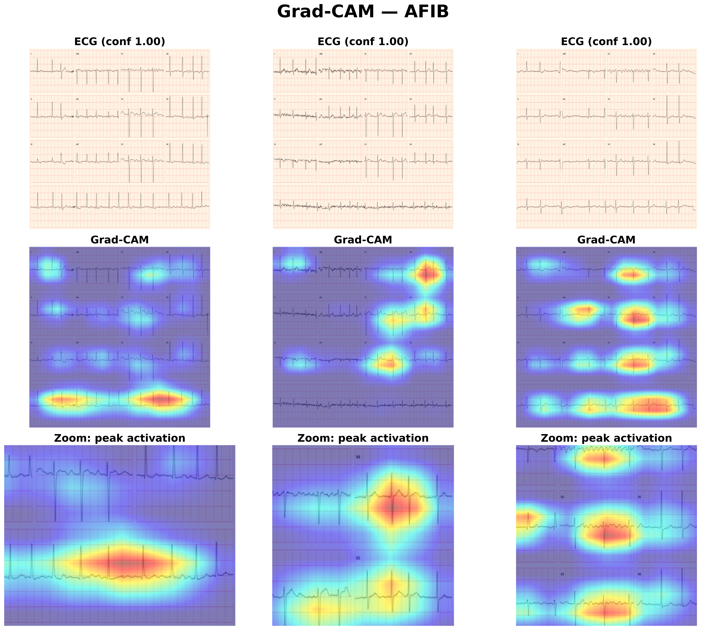 | 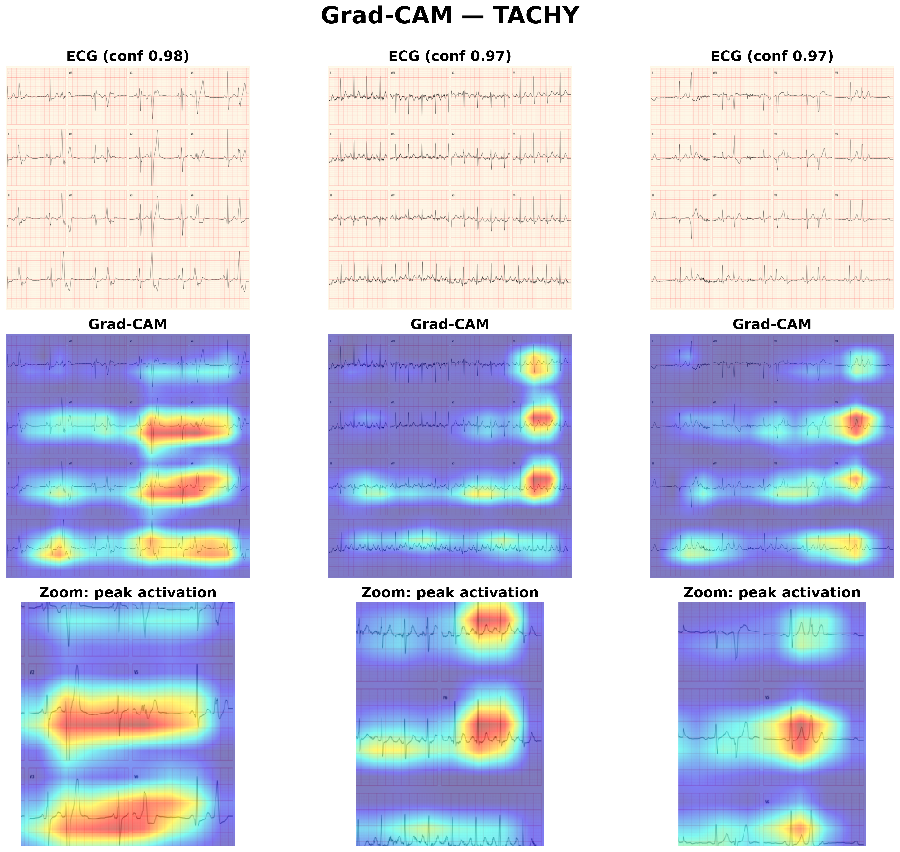 |

</div>

---

## Dataset

### PTB-XL — real clinical data
- PhysioNet **PTB-XL v1.0.3** (21,837 records), 4 classes: NORM, MI, AFIB, TACHY
- Rendered as clean, **label-free** 12-lead ECG paper images
- Grouped by `patient_id` so recordings from a patient never cross folds

### Gemini 3 Pro Image — generative
- **Gemini 3 Pro Image** ("Nano Banana Pro") via Google Vertex AI
- 160 images per class (640 total); prompts and seeds logged
- OCR-cleaned (EasyOCR + inpainting) so renders match the real, text-free style

### NeuroKit2 — physiological simulation
- Condition-specific waveform synthesis with realistic noise
- MI: per-region ST-elevation + Q-wave masks · AFIB: Markov RR irregularity + P-wave suppression
- Identical rendering pipeline; **capped at 500/class** for Experiment C

### Per-class training composition

| Class | Condition | PTB-XL | Gemini | NeuroKit2 (Exp C) |
|---|---|:---:|:---:|:---:|
| NORM | Normal ECG | 1500 | 160 | 500 |
| MI | Myocardial Infarction | 1500 | 160 | 500 |
| AFIB | Atrial Fibrillation | 1030 | 160 | 500 |
| TACHY | Tachycardia | **426** | 160 | 500 |

> TACHY has the fewest real records (426) — the augmentation effect is most pronounced here.

---

## Model & Training

| Component | Choice |
|---|---|
| Architecture | EfficientNet-B0 (primary) · EfficientNet-B1 (generalization) · ImageNet pretrained |
| Input | 512 × 512 RGB ECG images |
| Loss | Focal Loss (γ = 2) + inverse-frequency class weights |
| Optimizer | AdamW (lr 1e-4, wd 1e-4) · CosineAnnealingLR (η_min 1e-6) |
| Precision | FP16 mixed precision (AMP) |
| Batch | Effective 32 (micro-batch 16 × grad-accum 2, to fit 512px in 6 GB) |
| Epochs | 25 |
| Validation | 3-fold patient-grouped CV + repeated-seed CV (n = 9) |
| GPU | NVIDIA RTX 4050 (6 GB) |

---

## Project Structure

```
ecg-synthetic-research/
├── src/
│   ├── rendering/        PTB-XL / NeuroKit2 → label-free ECG images; Gemini OCR cleanup
│   ├── generation/       Vertex AI generation + prompt templates
│   ├── training/         train.py (A/B/C, multi-arch, 3-fold CV) · train_cross_domain.py (D/E)
│   ├── explainability/   Grad-CAM (per class + curated paper figures)
│   └── utils/            patient-grouped CV splits · calibration/ECE · secondary eval · figure makers
├── outputs/
│   ├── results/          per-run metrics, curves, calibration, confusion, predictions
│   ├── figures_paper/    high-DPI confusion matrices, Grad-CAMs, secondary graph
│   ├── results/secondary_test/   real / synthetic / combined suites
│   └── leakage_reports/  fold-level leakage verification
├── to_share/             manuscript bundle — report, LaTeX tables, figures, per-CSV graphs (see to_share/README.md)
├── data/                 metadata manifests + per-fold splits
└── README.md
```

---

## Setup & Reproduce

```bash
git clone https://github.com/TaimourKhan2132/ecg-synthetic-research.git
cd ecg-synthetic-research

python -m venv venv
.\venv\Scripts\activate            # Windows
pip install -r requirements.txt

# CUDA PyTorch (RTX 40-series)
pip install torch torchvision torchaudio --index-url https://download.pytorch.org/whl/cu130
```

Runs are seeded and each fold saves independently, so the pipeline is safe to
interrupt and resume. The **only variable across experiments is the training-set
composition** — validation and test are always real PTB-XL.

```bash
# 1. Render real data (PTB-XL -> label-free 512x512 ECG images)
python src/rendering/render_ptbxl.py
python src/rendering/render_neurokit2.py            # physiological simulation

# 2. Generate + OCR-clean Gemini images (requires Google Cloud credentials)
python src/generation/imagen_generate.py
python src/rendering/sanitize_imagen.py

# 3. Build patient mapping + verify no leakage (required before CV)
python src/create_ptbxl_mapping.py
python src/generate_leakage_report.py

# 4. Train experiments A / B / C  (3-fold CV, real-only val+test)
python run_all.py                                   # all A/B/C folds, or individually:
python src/training/train.py --experiment A
python src/training/train.py --experiment B
python src/training/train.py --experiment C --synth-cap 500   # paper's Exp C = capped simulation

# 5. Significance (repeated-seed CV, n=9 paired estimates vs baseline A)
python run_seeds.py

# 6. Architecture generalization on EfficientNet-B1
python run_b1.py

# 7. Domain-transfer ablations D/E (train on synthetic only, test on real)
python src/training/train_cross_domain.py

# 8. Secondary evaluation (real / held-out synthetic / combined 50:50) + figures
python src/utils/eval_combined_test.py
python src/utils/make_confusion_matrices.py
python src/utils/make_csv_graphs.py
```

---

## Limitations

- Synthetic ECGs are **not cardiologist-validated** — traces may be visually plausible yet
  physiologically imperfect.
- **TACHY rests on 426 real records** — a thin statistical base for strong absolute claims.
- NeuroKit2 TACHY simulates **sinus tachycardia only**, while PTB-XL TACHY also includes SVT and
  ectopic rhythms (a distribution mismatch).
- Absolute per-class scores retain **fold-to-fold variance**; the reliable claims are the **paired
  augmentation effects**, not the exact absolute values.
- Main study uses EfficientNet-B0/B1 at a single input resolution; broader architecture/resolution
  sensitivity is not explored.
- **Not intended for clinical deployment.**

---

## Tech Stack

`PyTorch` · `EfficientNet-B0/B1` · `Gemini 3 Pro Image (Vertex AI)` · `NeuroKit2` · `PTB-XL`
`EasyOCR` · `pytorch-grad-cam` · `Focal Loss` · `Mixed-Precision AMP` · `Patient-grouped 3-fold CV`

---

## Authors

<table>
  <tr>
    <td align="center"><b>Taimour Khan</b></td>
    <td align="center"><b>Hamza Chaudhary</b></td>
    <td align="center"><b>Waleed Nadeem</b></td>
    <td align="center"><b>Hashaam Ijaz</b></td>
  </tr>
</table>

> Department of Data Science, University of Management and Technology (UMT), Lahore.
> Target venue: International Medical AI Conference, Dubai.

---

## License

For academic research only. PTB-XL data is subject to the
[PhysioNet Credentialed Health Data License](https://physionet.org/content/ptb-xl/view-license/1.0.3/).
