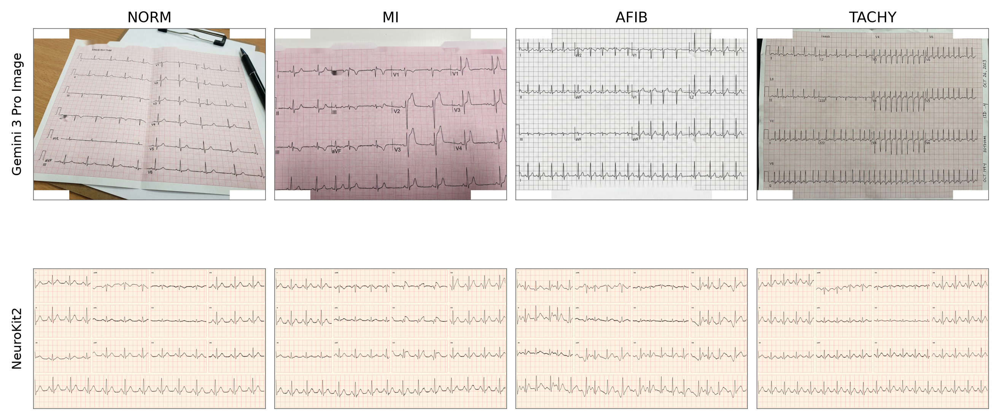
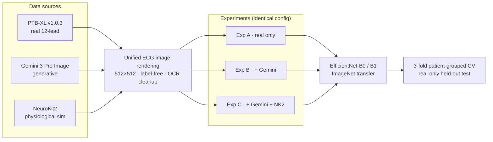
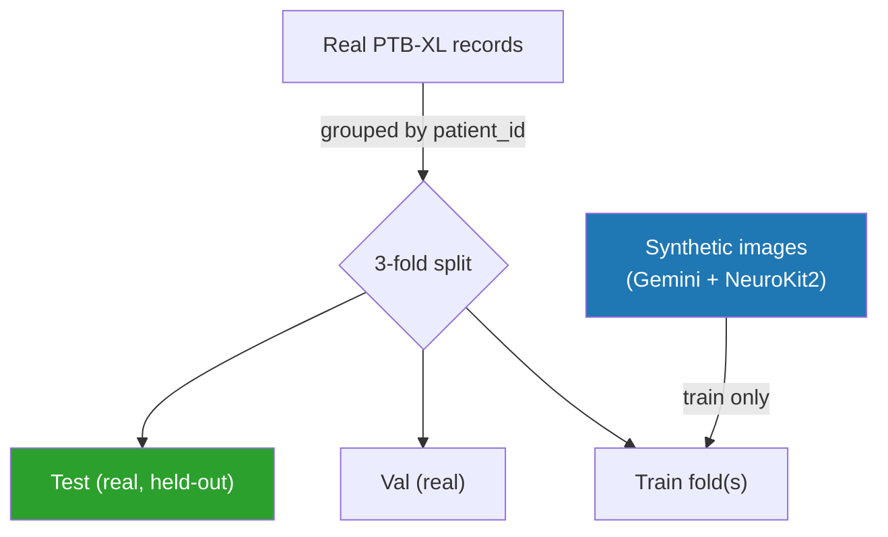
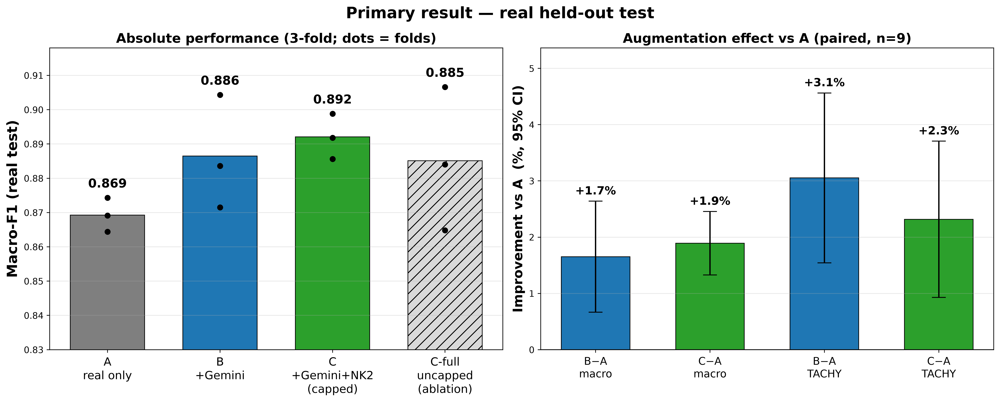
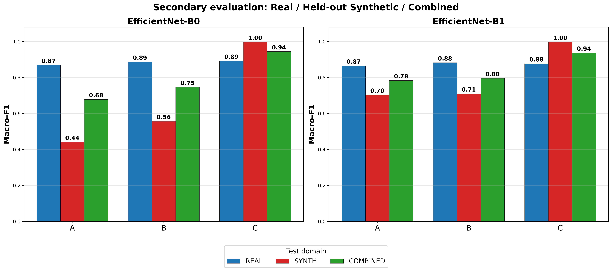
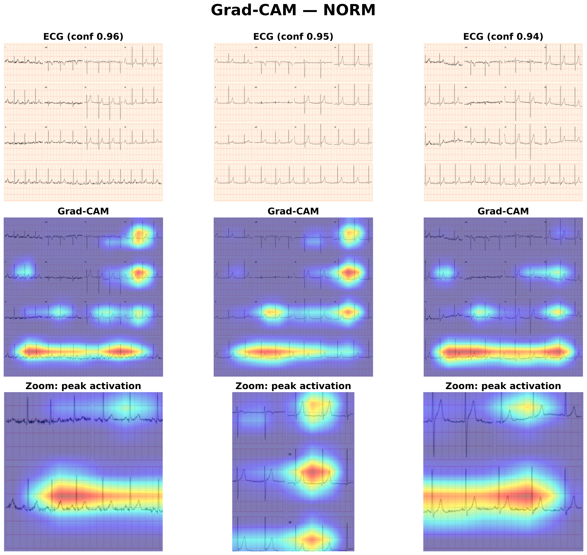
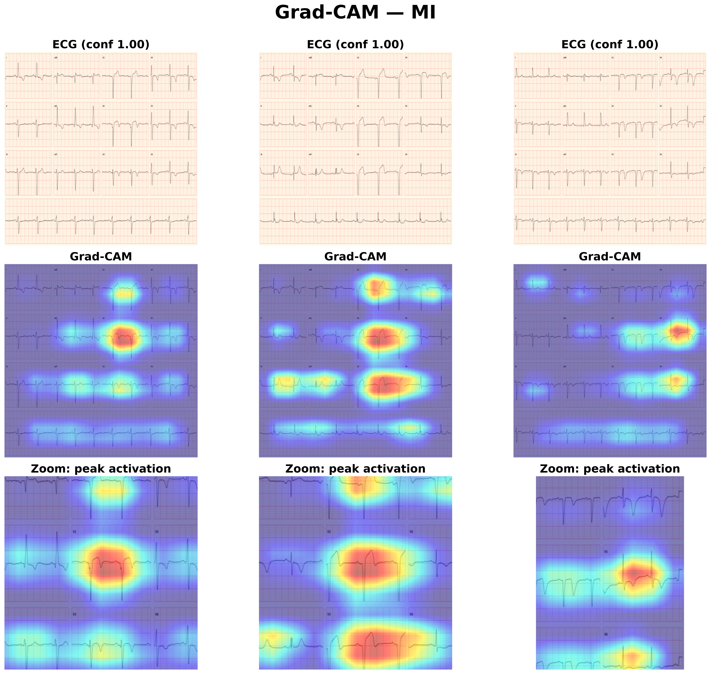
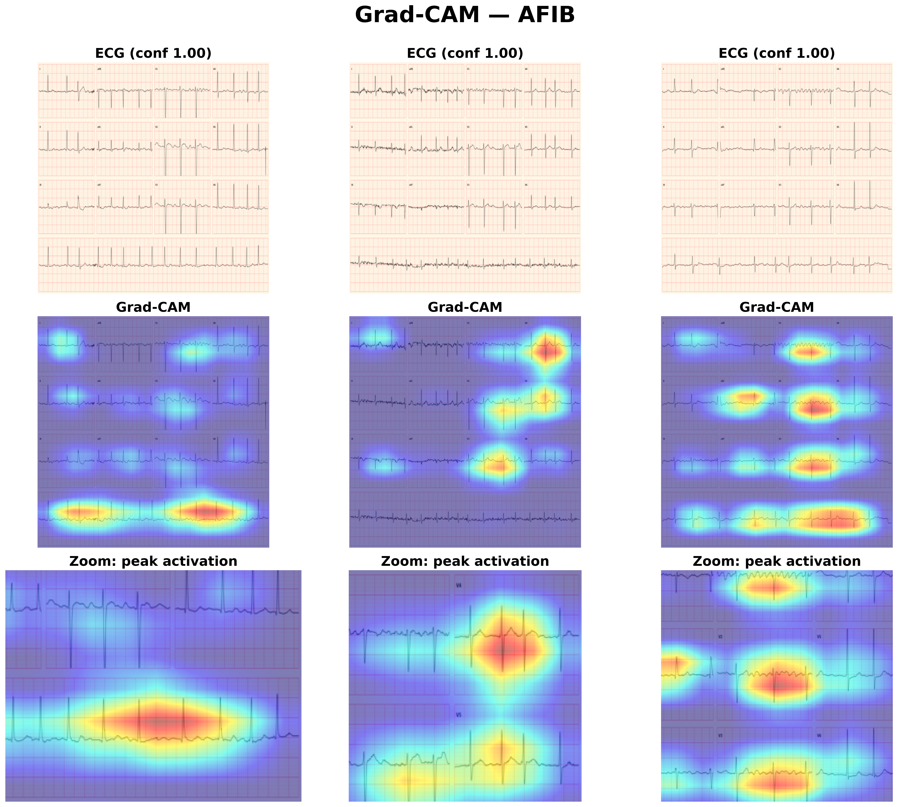
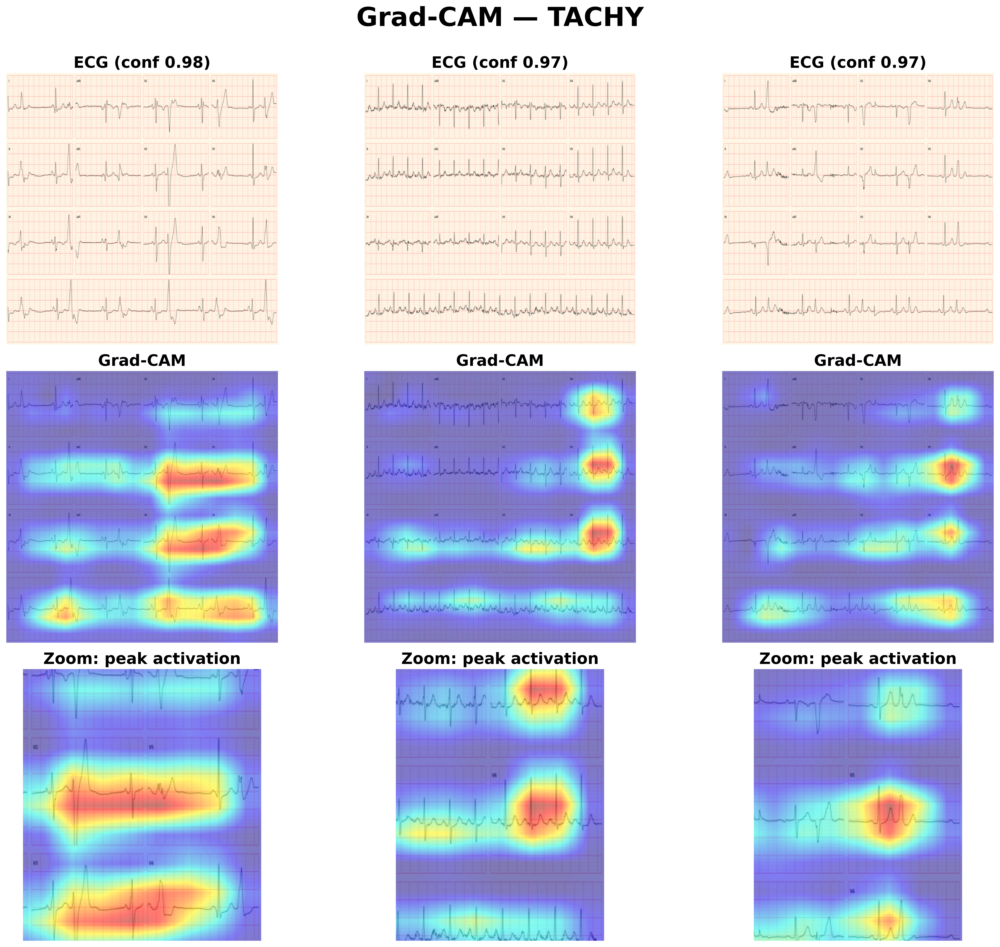

<div align="center">

# ECG Synthetic Augmentation Research

**Does adding AI-generated ECG images to real training data improve arrhythmia classification on real patients?**

*Towards Effective Synthetic ECG Augmentation: Comparing Diffusion Models and Physiological Simulation for Heart Disease Classification*<br/>
Accepted at the **International Medical AI Conference, Dubai**, to be presented in October 2026.

[](#citation)
[](https://github.com/TaimourKhan2132/ecg-synthetic-research/actions/workflows/tests.yml)


-1f77b4)



<em>The two synthetic sources, one image per class: Gemini 3 Pro Image (top) and NeuroKit2 physiological simulation (bottom).</em>

</div>

---

## Highlights

- **A modest but statistically significant gain.** Adding Gemini-generated images lifts macro-F1 from
  **0.8693 to 0.8865** and the scarcest class (TACHY) by **+3.1 F1 points**. The effect is paired across
  **9 repeated-seed estimates**, is positive in every one, and has *p* = 0.005 / 0.002.
- **The dose of simulation matters.** Capping NeuroKit2 at 500 images per class gives the best model
  (macro-F1 **0.892**, accuracy **0.902**, ROC-AUC **0.981**). The uncapped version (1,500 per class)
  adds nothing.
- **The result holds up under other tests.**
  - It replicates on a second backbone: EfficientNet-B1, B−A = +1.8, *p* = 0.024.
  - A DeLong test confirms the ROC-AUC gains are significant for NORM, MI and AFIB (*p* < 0.001).
- **The evaluation is leak-proof.** Patients are grouped across cross-validation folds, validation and
  test sets contain real ECGs only, and synthetic images are used for training only. This is
  enforced by [tests](tests/test_cv_split.py).
- **The model looks at the right things.** Grad-CAM shows attention on QRS complexes and rhythm
  spacing, not on chart borders or grid.

## Contents

- [How the study works](#how-the-study-works)
- [Experiments](#experiments)
- [Results](#results)
- [Dataset](#dataset)
- [Model and training](#model-and-training)
- [Tests](#tests)
- [Setup and reproduce](#setup-and-reproduce)
- [Project structure](#project-structure)
- [Data availability](#data-availability)
- [Limitations](#limitations)
- [Citation](#citation)

---

## How the study works


```mermaid
flowchart LR
    subgraph Sources["Data sources"]
        P["PTB-XL v1.0.3<br/>real 12-lead"]
        G["Gemini 3 Pro Image<br/>generative"]
        N["NeuroKit2<br/>physiological sim"]
    end
    R["Unified ECG image rendering<br/>512×512 · label-free · OCR cleanup"]
    P --> R
    G --> R
    N --> R
    subgraph Exp["Experiments (identical config)"]
        A["Exp A · real only"]
        B["Exp B · + Gemini"]
        C["Exp C · + Gemini + NK2"]
    end
    R --> A
    R --> B
    R --> C
    M["EfficientNet-B0 / B1<br/>ImageNet transfer"]
    A --> M
    B --> M
    C --> M
    M --> V["3-fold patient-grouped CV<br/>real-only held-out test"]
```

### The rule that keeps the evaluation honest

Synthetic images are used **only in the training split**. Validation and test sets contain **real
PTB-XL records only**, and records are grouped by patient, so **no patient appears in more than one
split**. The real validation and test sets are also identical across experiments A, B and C, so the
training data is the only thing that changes. Every one of these guarantees is checked in
[`tests/test_cv_split.py`](tests/test_cv_split.py).


```mermaid
flowchart TD
    RD["Real PTB-XL records"] -->|"grouped by patient_id"| SPLIT{"3-fold split"}
    SPLIT --> TR["Train fold(s)"]
    SPLIT --> VA["Val (real)"]
    SPLIT --> TE["Test (real, held-out)"]
    SY["Synthetic images<br/>(Gemini + NeuroKit2)"] -->|"train only"| TR
    style TE fill:#2ca02c,color:#fff
    style SY fill:#1f77b4,color:#fff
```

---

## Experiments

| ID | Training data | Test data | Purpose |
|:---:|---|---|---|
| **A** | PTB-XL real (4,456) | PTB-XL real, patient-split | Baseline |
| **B** | PTB-XL + Gemini (5,096) | PTB-XL real, patient-split | Generative augmentation |
| **C** | PTB-XL + Gemini + NeuroKit2, capped at 500/class (7,096) | PTB-XL real, patient-split | Combined augmentation |
| **D**\* | NeuroKit2 only | Full PTB-XL real | Domain-transfer ablation |
| **E**\* | Gemini only | Full PTB-XL real | Domain-transfer ablation |

\*D and E are **ablations**. They show that training on synthetic images alone cannot replace real
data (macro-F1 0.328 for D, 0.397 for E). This supports the conclusion that the A → B → C gains come
from *augmenting* real data.

**Validation:** 3-fold patient-grouped cross-validation. Significance testing uses **repeated-seed**
cross-validation (3 seeds × 3 folds = n = 9 paired estimates). Leakage reports are in
[`outputs/leakage_reports/`](outputs/leakage_reports/).

---

## Results

### Primary results on the real held-out test (3-fold mean)

| Experiment | Accuracy | Macro-F1 | ROC-AUC | PR-AUC | Cohen's κ | MCC | ECE ↓ |
|---|:---:|:---:|:---:|:---:|:---:|:---:|:---:|
| **A**: real only | 0.8813 | 0.8693 | 0.9753 | 0.9344 | 0.8344 | 0.8375 | 0.105 |
| **B**: + Gemini | 0.8936 | 0.8865 | 0.9791 | 0.9413 | 0.8508 | 0.8528 | 0.098 |
| **C**: + Gemini + NK2 | **0.9015** | **0.8921** | **0.9813** | **0.9433** | **0.8617** | **0.8624** | **0.088** |

### Is the improvement real? Repeated-seed paired test (n = 9)

| Comparison | Δ Macro-F1 | Δ TACHY-F1 | Positive estimates (macro / TACHY) | *p* (macro / TACHY) |
|---|:---:|:---:|:---:|:---:|
| **B − A** | +1.65% | +3.05% | 9/9 · 9/9 | 0.005 / 0.002 |
| **C − A** | +1.89% | +2.32% | 9/9 · 8/9 | <0.001 / 0.005 |
| C-full (uncapped) − B | ≈ 0 | ≈ 0 | sign flips across folds | n.s. |

<div align="center">

<br/><em>Left: absolute macro-F1 (dots = folds; the hatched bar is the uncapped ablation). Right: paired
improvement over A across the 9 estimates. Every 95% CI sits above zero.</em>
</div>

### ROC-AUC significance (DeLong test)

This is a paired, per-class one-vs-rest DeLong test on the pooled out-of-fold predictions
(N = 4,456 real test samples).

| Class | AUC A | AUC B | AUC C | *p* (B − A) | *p* (C − A) |
|---|:---:|:---:|:---:|:---:|:---:|
| NORM | 0.9805 | 0.9818 | 0.9853 | 0.075 | **< 0.001** |
| MI | 0.9495 | 0.9565 | 0.9633 | **< 0.001** | **< 0.001** |
| AFIB | 0.9883 | 0.9910 | 0.9913 | **0.001** | **< 0.001** |
| TACHY | 0.9811 | 0.9827 | 0.9842 | 0.346 | 0.094 |

The TACHY AUC also rises, but with only 426 TACHY records the test has limited power. You can
recompute the whole table from committed per-sample probabilities, without a GPU or any
checkpoints; see [`tests/test_delong.py`](tests/test_delong.py).

### Per-class F1 (3-fold mean)

| Experiment | NORM | MI | AFIB | TACHY |
|---|:---:|:---:|:---:|:---:|
| **A**: real only | 0.9095 | 0.8493 | 0.9182 | 0.8001 |
| **B**: + Gemini | 0.9091 | 0.8639 | 0.9316 | **0.8411** |
| **C**: + Gemini + NK2 | **0.9171** | **0.8801** | **0.9345** | 0.8365 |

The largest single-class F1 gains are on **MI** (+3.1 at C) and **TACHY** (+4.1 at B). Augmentation
**redistributes** performance toward the harder classes rather than lifting every class uniformly.

### Confusion matrices (row-normalized recall, %)

<div align="center">

<br/><em>Aggregated over 3 folds.
MI recall rises from 77.5% to 84.8% and AFIB from 92.6% to 94.8%.
TACHY recall falls from 90.8% to 85.7%, but TACHY precision rises from 71.5% to 81.8%,
so the TACHY F1 gain comes from precision, not recall.</em>
</div>

### Secondary evaluation: robustness across test domains

As well as the primary real-only test, each model is scored on a **held-out synthetic** set
(NeuroKit2 traces that no model trained on) and a **balanced 50:50 combined** set.

| Model | Real | Synthetic (held-out) | Combined (50:50) |
|---|:---:|:---:|:---:|
| **A**: real only | 0.869 | 0.441 | 0.679 |
| **B**: + Gemini | 0.887 | 0.557 | 0.747 |
| **C**: + Gemini + NK2 | 0.892 | **0.997** | **0.945** |

<div align="center">

</div>

The **combined** score measures robustness. It is **not** real-world clinical performance, which
remains the 0.892 on the real test. Experiment C trained on NeuroKit2, so held-out NeuroKit2 images
fall within what it has already seen. The point is that adding simulation does not *harm* accuracy
on real data, while widening the range of inputs the model handles.

### Architecture generalization (EfficientNet-B1)

The gain is **not tied to one backbone**. Repeating A/B/C on EfficientNet-B1 with byte-identical
splits gives:

| EfficientNet-B1 (3-fold mean) | Macro-F1 | TACHY-F1 |
|---|:---:|:---:|
| **A**: real only | 0.865 | 0.803 |
| **B**: + Gemini | 0.883 | 0.832 |
| **C**: + Gemini + NK2 | 0.877 | 0.818 |

The generative gain replicates: **B − A = +1.8 macro-F1, 3/3 folds, *p* = 0.024.**

### Domain-transfer ablation (train on synthetic, test on real)

| Experiment | Accuracy | Macro-F1 | ROC-AUC | Interpretation |
|---|:---:|:---:|:---:|---|
| [**D**: NK2 → PTB-XL](outputs/results/exp_D_neurokit2_train_ptbxl_test_img512_bs32_e25/) | 0.350 | 0.328 | 0.637 | Large gap between simulation and real data |
| [**E**: Gemini → PTB-XL](outputs/results/exp_E_imagen_train_ptbxl_test_img512_bs32_e25/) | 0.442 | 0.397 | 0.721 | Gemini transfers to real data better than NK2 |

Both transfer poorly on their own. That is the expected, reassuring result: synthetic data is
useful as an **addition to** real data, not a replacement for it.

### Grad-CAM: what the network looks at

Attention concentrates on **waveform morphology** (QRS complexes and rhythm spacing) rather than
chart borders or grid artifacts. Each column shows the input render, the class-discriminative
heatmap, and a zoomed crop of the peak-activation region. The samples are correctly classified,
high-confidence predictions from Experiment C.

<div align="center">

| NORM | MI | AFIB | TACHY |
|:---:|:---:|:---:|:---:|
|  |  |  |  |

</div>

---

## Dataset

### PTB-XL: real clinical data
- PhysioNet **PTB-XL v1.0.3**: 21,799 records from 18,869 patients, open access under **CC BY 4.0**.
- 4 classes (NORM, MI, AFIB, TACHY). Records with conflicting labels were excluded. After per-class
  caps (seed 42) this leaves **4,456 images**.
- Rendered as clean, **label-free** 12-lead ECG paper images. There is no condition text, heart rate
  or ID on the image, because an early version showed the model reading printed labels.
- Grouped by `patient_id`, so recordings from one patient never cross folds.

### Gemini 3 Pro Image: generative
- **Gemini 3 Pro Image** ("Nano Banana Pro", `gemini-3-pro-image`) via Google Vertex AI.
- 160 images per class (640 in total), from 8 prompt templates per class.
- Every image's prompt text, model ID and timestamp are logged in
  [`metadata/imagen_generated.csv`](metadata/imagen_generated.csv).
- Cleaned with OCR (EasyOCR plus inpainting) to match the real, text-free style.

### NeuroKit2: physiological simulation
- Condition-specific waveform synthesis with realistic noise: baseline wander, EMG noise and
  powerline interference.
- MI uses per-region ST-elevation and Q-wave masks. AFIB uses Markov-chain RR irregularity with
  P-wave suppression.
- Seeded generation, rendered with the identical pipeline, and **capped at 500 per class** for
  Experiment C.

### Per-class training composition

| Class | Condition | PTB-XL | Gemini | NeuroKit2 (Exp C) |
|---|---|:---:|:---:|:---:|
| NORM | Normal ECG | 1500 | 160 | 500 |
| MI | Myocardial Infarction | 1500 | 160 | 500 |
| AFIB | Atrial Fibrillation | 1030 | 160 | 500 |
| TACHY | Tachycardia | **426** | 160 | 500 |

---

## Model and training

| Component | Choice |
|---|---|
| Architecture | EfficientNet-B0 (primary) and EfficientNet-B1 (generalization), ImageNet-pretrained |
| Input | 512 × 512 RGB ECG images |
| Loss | Focal loss (γ = 2) + inverse-frequency class weights |
| Optimizer | AdamW (lr 1e-4, wd 1e-4), CosineAnnealingLR (η_min 1e-6) |
| Precision | FP16 mixed precision (AMP) |
| Batch | Effective 32 (micro-batch 16 × gradient accumulation 2, to fit 512 px into 6 GB) |
| Epochs | 25 |
| Validation | 3-fold patient-grouped CV + repeated-seed CV (n = 9) |
| Hardware | Single NVIDIA RTX 4050 laptop GPU (6 GB) |

---

## Tests

The evaluation protocol and the statistics are covered by unit tests. They run on every push,
without PyTorch or the image data.

| Test file | What it guarantees |
|---|---|
| [`tests/test_cv_split.py`](tests/test_cv_split.py) | Synthetic images never enter validation or test; no patient spans two splits; the test folds partition the real set; adding synthetic data leaves the real splits unchanged |
| [`tests/test_delong.py`](tests/test_delong.py) | The DeLong AUCs match scikit-learn (including ties); the p-values behave correctly; the paper's DeLong table is reproduced exactly from committed probabilities |

```bash
pip install -r tests/requirements.txt
python -m pytest tests -v
```

---

## Setup and reproduce

```bash
git clone https://github.com/TaimourKhan2132/ecg-synthetic-research.git
cd ecg-synthetic-research

python -m venv venv
.\venv\Scripts\activate            # Windows
pip install -r requirements.txt

# CUDA PyTorch (RTX 40-series)
pip install torch torchvision torchaudio --index-url https://download.pytorch.org/whl/cu130
```

Runs are seeded, and each fold saves independently, so the pipeline is safe to interrupt and resume.
The **only thing that varies between experiments is the training set**. Validation and test are
always real PTB-XL.

```bash
# 1. Render real data (PTB-XL -> label-free 512x512 ECG images)
python src/rendering/render_ptbxl.py
python src/rendering/render_neurokit2.py            # physiological simulation

# 2. Generate + OCR-clean Gemini images (requires Google Cloud credentials)
python src/generation/imagen_generate.py
python src/rendering/sanitize_imagen.py

# 3. Build patient mapping + verify no leakage (required before CV)
python src/create_ptbxl_mapping.py
python src/generate_leakage_report.py

# 4. Train experiments A / B / C  (3-fold CV, real-only val+test)
python scripts/run_all.py                           # all A/B/C folds, or individually:
python src/training/train.py --experiment A
python src/training/train.py --experiment B
python src/training/train.py --experiment C --synth-cap 500   # paper's Exp C = capped simulation

# 5. Significance (repeated-seed CV, n=9 paired estimates vs baseline A)
python scripts/run_seeds.py

# 6. Architecture generalization on EfficientNet-B1
python scripts/run_b1.py

# 7. Domain-transfer ablations D/E (train on synthetic only, test on real)
python src/training/train_cross_domain.py

# 8. Secondary evaluation, DeLong test and figures
python src/utils/eval_combined_test.py
python src/utils/delong_test.py
python src/utils/make_confusion_matrices.py --panel
python src/utils/make_csv_graphs.py

# Watch a long run live
python scripts/progress.py --watch
```

---

## Project structure

```
ecg-synthetic-research/
├── src/
│   ├── rendering/        PTB-XL / NeuroKit2 → label-free ECG images; Gemini OCR cleanup
│   ├── generation/       Vertex AI generation + prompt templates
│   ├── training/         train.py (A/B/C, multi-arch, 3-fold CV) · train_cross_domain.py (D/E)
│   ├── explainability/   Grad-CAM (per class + curated paper figures)
│   └── utils/            patient-grouped CV · calibration/ECE · DeLong · secondary eval · figure makers
├── scripts/              experiment runners (A/B/C, seeds, B1) and a live progress viewer
├── tests/                protocol + statistics tests (run in CI)
├── outputs/
│   ├── results/          per-run metrics, curves, calibration, confusion, predictions, DeLong
│   ├── figures_paper/    high-DPI confusion matrices, Grad-CAMs, secondary graph
│   └── leakage_reports/  fold-level leakage verification
├── to_share/             manuscript bundle: report, LaTeX tables, figures, per-CSV graphs
├── metadata/             rendered / generated image manifests (incl. Gemini prompts)
├── fig/                  synthetic-sample figure
├── CITATION.cff
└── README.md
```

---

## Data availability

- **PTB-XL** is openly available from [PhysioNet](https://physionet.org/content/ptb-xl/1.0.3/)
  under CC BY 4.0. The rendering scripts regenerate the image set deterministically.
- **NeuroKit2** images are regenerated from seeded code.
- **Gemini images and trained checkpoints are not stored in this repository.** The Gemini prompts
  and per-image generation log are included in `metadata/`.
- **Every reported metric** is traceable to a CSV in `outputs/results/`. The per-sample
  probabilities behind the DeLong test are in `outputs/results/delong/`.

---

## Limitations

- Synthetic ECGs have **not been validated by cardiologists**. Traces may look plausible but be
  physiologically imperfect.
- **TACHY rests on 426 real records**, a thin statistical base for strong absolute claims.
- NeuroKit2 TACHY simulates **sinus tachycardia only**, while PTB-XL TACHY also includes SVT and
  ectopic rhythms, so the two distributions don't match.
- The 500-per-class cap was the only cap value tested. It was chosen from a diagnostic analysis,
  so treat it as exploratory rather than pre-registered.
- Absolute per-class scores vary from fold to fold. The reliable claims are the **paired
  augmentation effects**, not the exact absolute values.
- The backbones are ImageNet-pretrained and data-efficient, so augmentation may help more when
  training from scratch or with less real data.
- **Not intended for clinical deployment.**

---

## Citation

If you use this code or these results, please cite the paper. GitHub's *Cite this repository*
button uses [`CITATION.cff`](CITATION.cff). Proceedings details will be added on publication.

```bibtex
@inproceedings{khan2026synthetic_ecg,
  title     = {Towards Effective Synthetic {ECG} Augmentation: Comparing Diffusion Models and
               Physiological Simulation for Heart Disease Classification},
  author    = {Khan, Taimour and Chaudhary, Hamza and Nadeem, Waleed and Ijaz, Hashaam and
               Nawaz, Muhammad Wasim},
  booktitle = {International Medical AI Conference},
  address   = {Dubai},
  year      = {2026}
}
```

Please also cite PTB-XL: Wagner, P., Strodthoff, N., *et al.* "PTB-XL, a large publicly available
electrocardiography dataset." *Scientific Data* 7, 154 (2020).

---

## Authors

<table>
  <tr>
    <td align="center"><b>Taimour Khan</b></td>
    <td align="center"><b>Hamza Chaudhary</b></td>
    <td align="center"><b>Waleed Nadeem</b></td>
    <td align="center"><b>Hashaam Ijaz</b></td>
  </tr>
</table>

Supervised by **Muhammad Wasim Nawaz**, Department of Artificial Intelligence, University of
Management and Technology (UMT), Lahore.

---

## License

The code and results are released for academic research use. PTB-XL is distributed by PhysioNet
under the [Creative Commons Attribution 4.0 International License](https://physionet.org/content/ptb-xl/view-license/1.0.3/).
